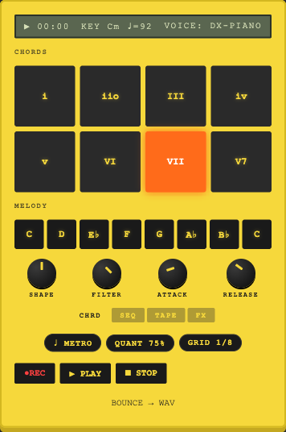

# Pocket

A chord-and-melody pocket instrument. A small hardware-style chassis in the tradition of handheld groove
boxes: chord pads and melody pads over an always-on tape track, with a 4-track and an editor to come.



## Status

**v0.2.2 "First Playable"** Chord pads, melody pads, single tape track, REC/PLAY/STOP, WAV export. MacOS desktop (Tauri) + standalone web. SEQ / TAPE-editor / FX / multi-track / mobile are later versions.

This is an early prototype, not a finished product. The `localhost` address below is a local development server, not a hosted demo.

## Develop

**Prereqs**: Node 20+, pnpm 9, Rust (only for the desktop build).

```bash
pnpm install
pnpm --filter @pocket/web dev          # web app at http://localhost:5173
pnpm --filter @pocket/desktop dev      # native macOS window
pnpm -r test                           # all unit tests
pnpm -r typecheck                      # all packages
```

## Build a .dmg

```bash
pnpm --filter @pocket/desktop build
# Output: apps/desktop/src-tauri/target/release/bundle/dmg/Pocket_0.2.2_*.dmg
```

## Acceptance flow (v0.2.2)

1. Boot the app (web or desktop).
2. Click **START POCKET** Web Audio requires a user gesture before the engine boots.
3. Tap chord pads → hear chords. Tap melody pads → hear notes in the same key.
4. **REC** arms tape track 1. Play. **STOP** ends the take.
5. **PLAY** plays the take back.
6. **BOUNCE → WAV** downloads the take as a 16-bit stereo WAV.

If you hear noticeable latency, you're probably on Bluetooth audio (AirPods etc.). Wired or built-in speakers feel much tighter, this is a platform limitation, not an app bug.

## Repo layout

- `packages/model` pure music theory + shared types (no DOM, no Web Audio)
- `packages/engine` Web Audio + AudioWorklet + tape ring buffer + WAV encoder
- `packages/ui` React components in the device design system
- `apps/web`, the instrument (Vite)
- `apps/desktop` Tauri 2 wrapper for macOS

If you want to read rather than run, start with `packages/model/src/music.ts` for the chord and scale
theory, and `packages/engine/src/AudioEngine.ts` for the audio graph. The tape track is
`packages/engine/src/ringbuffer.ts` and the export path is `wav.ts`. Those four carry the ideas.

## How this was built

Written with AI-assisted development. The architecture, the constraints and the review
decisions are mine. Most of the implementation and documentation was produced by models
working to those specifications, with the test suite as the gate on every change during
development.
